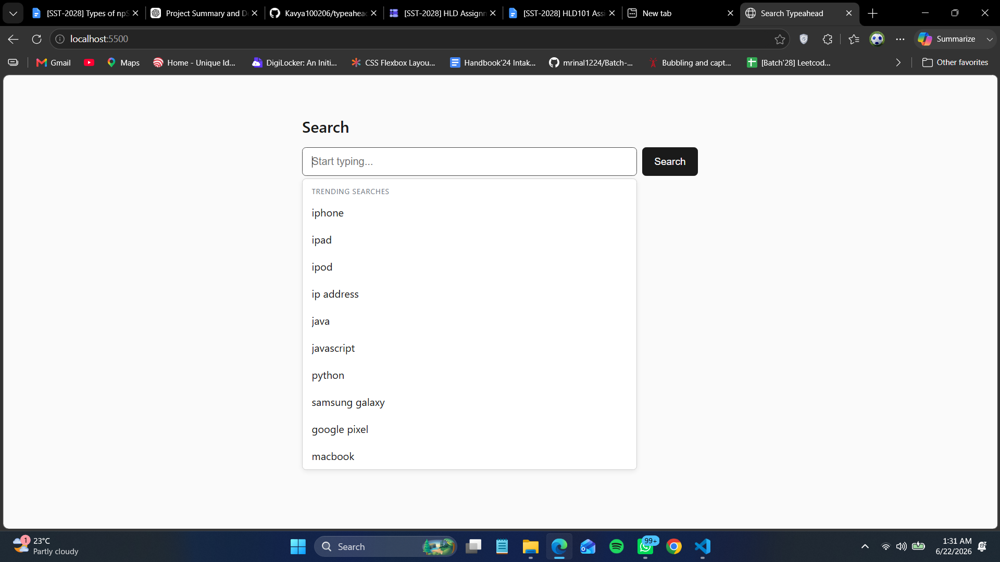
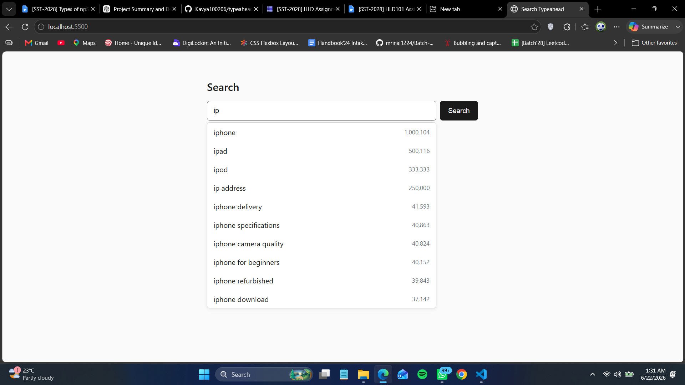
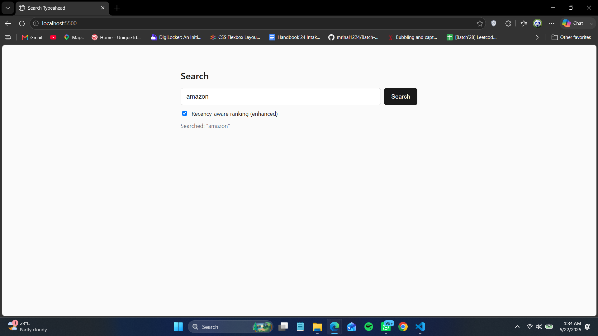
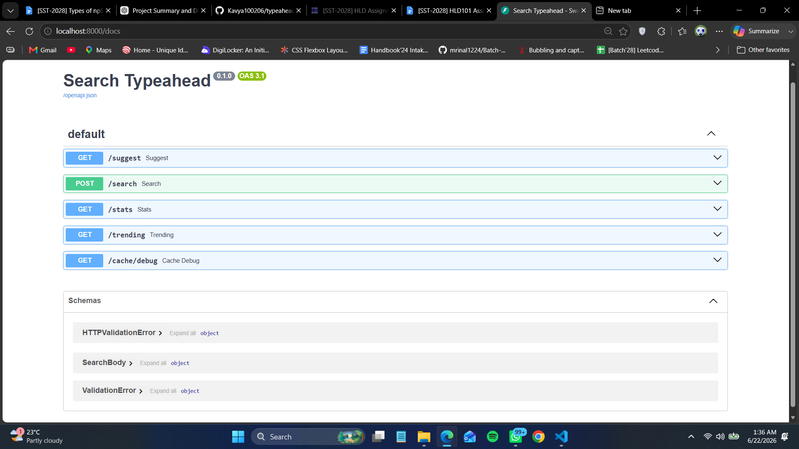

# Search Typeahead

A search typeahead system: as you type, it shows the top suggestions for your
prefix, ranked by all-time popularity or by a recency-aware score. Built to learn
and explain the HLD concepts behind it (trie + top-k, cache-aside + TTL,
consistent hashing, batch writes, recency scoring).

- Backend: Python + FastAPI, SQLite, in-process cache.
- Frontend: plain TypeScript (no framework, no bundler), compiled with `tsc`.

See [docs/architecture.md](docs/architecture.md) for the full design and
[docs/performance-report.md](docs/performance-report.md) for measured numbers.

## Screenshots

**Trending on focus.** Clicking the empty search box shows trending searches
(popular queries when there is no recent activity).



**Live suggestions.** Typing a prefix shows the top matches ranked by count.



**Recency-aware ranking and search submit.** The enhanced toggle switches to the
trending-aware ranking; submitting a search shows the confirmation.



**API docs.** FastAPI serves interactive Swagger docs at `/docs`.



## Architecture

The one fact that drives the design: reads vastly outnumber writes (every
keystroke is a read, only a submit is a write). So the read path is optimized
hard and writes are allowed to be delayed.

```
  browser ── debounce ──> GET /suggest?q=<prefix>&mode=basic|enhanced
     ^                          |
     | top 10                   v
     |                   +--------------+   hit
     |                   | CacheClient  |--------> return cached top-10
     |                   |  + hash ring |
     |                   +------+-------+   miss
     |                          v
     |                   Trie.top_k(prefix)  -- fills cache --> return
     |
  Enter / click ──> POST /search ──> BatchWriter.enqueue(query)
                                       aggregate query -> delta
                                       flush on size OR timer
                                          |
                                          v
                                   SQLite store (query -> count)
                                   + Trie re-rank
  GET /trending ──> log(popularity) + weight * recency, over popular + recent
```

**Components** (one job each):

| Component | File | Job |
|-----------|------|-----|
| Trie | `backend/app/trie.py` | prefix match + precomputed top-k at every node |
| Primary store | `backend/app/store.py` | durable `query -> count`, source of truth |
| Cache node | `backend/app/cache/cache_node.py` | one in-memory cache with TTL + hit/miss counters |
| Hash ring | `backend/app/cache/ring.py` | consistent hashing, prefix -> node |
| Cache client | `backend/app/cache/cache_client.py` | read-path front door, routes to the owning node |
| Batch writer | `backend/app/batch_writer.py` | buffer + aggregate + bulk flush of writes |
| Trending | `backend/app/trending.py` | recency scoring via exponential time decay |
| Ingest | `backend/app/ingest.py` | load dataset into the store, build the trie |
| API | `backend/app/main.py` | the FastAPI routes |
| Frontend | `frontend/src/*.ts` | UI, debounce, keyboard nav, dropdown |

**Read path.** `/suggest` normalizes the prefix, the cache client hashes it on
the ring to pick the owning cache node, and returns the cached top-10 on a hit.
On a miss the trie walks to the prefix node, reads its precomputed list, fills the
cache, and returns. `mode=enhanced` skips the cache and recomputes a
recency-aware ranking, since trending scores change too fast to cache.

**Write path.** `/search` drops the query into the batch writer and returns
immediately (no write on the request). Submits aggregate in a `query -> delta`
map and flush in one transaction on a size threshold or a timer, re-ranking the
trie. Trending is updated in memory per submit, so recency stays live while the
durable count lags until the flush. Because writes are delayed, the read path is
eventually consistent (the latency-vs-freshness trade).

## Layout

```
backend/
  app/            FastAPI app, trie, store, cache, batch writer, trending
  scripts/        dataset generator + demos + benchmark
  data/           queries.csv (dataset) and queries.db (SQLite)
frontend/
  src/*.ts        debounce, api, ui, main
  index.html, style.css
docs/             architecture + performance report
```

## Prerequisites

- Python 3.10+
- Node 18+ (only to compile the TypeScript; the page itself runs framework-free)

## Backend

```bash
cd backend
pip install -r requirements.txt

# One time: generate the dataset (~120k rows) and load it into SQLite.
python scripts/generate_dataset.py
python -m app.ingest

# Run the API (rebuilds the trie from the store on startup, ~12s).
python -m uvicorn app.main:app --port 8000
```

API docs are auto-generated at http://localhost:8000/docs.

## Frontend

```bash
cd frontend
npm install
npm run build        # compiles src/*.ts -> dist/*.js  (use `npm run watch` while developing)
python -m http.server 5500
```

Open http://localhost:5500. Type to see suggestions; tick "Recency-aware ranking"
to switch to the enhanced ranking; the trending panel updates as searches come in.

## API

| Endpoint | Returns |
|----------|---------|
| `GET /suggest?q=<prefix>&mode=basic\|enhanced` | up to 10 suggestions; `basic` = all-time count (cached), `enhanced` = recency-aware blend |
| `POST /search` `{"query": "..."}` | `{"message": "Searched"}`; records the query via the batch writer |
| `GET /trending?k=10` | current trending queries by decayed recency score |
| `GET /cache/debug?prefix=<p>` | which cache node owns the prefix, and hit/miss |
| `GET /stats` | batch-writer submits vs DB writes, and cache hit/miss |

Edge cases handled by `/suggest`: empty input, missing `q`, mixed case
(normalized), and a prefix with no matches (empty list, not an error).

## Dataset

`scripts/generate_dataset.py` writes `data/queries.csv` (`query,count`, ~120k
rows) with prefix overlap and Zipf-like skew so the trie and ranking are actually
exercised. `python -m app.ingest` loads the CSV into SQLite; the trie is rebuilt
from SQLite on every server start.

## Demos and benchmark

```bash
cd backend
python scripts/remap_demo.py      # consistent hashing: ~17% remap vs ~80% for hash % N
python scripts/batch_demo.py      # batching: 1000 submits -> ~10 DB writes (100x)
python scripts/trending_demo.py   # a cold query rises on recency, then fades
python scripts/benchmark.py       # latency p95, cache hit rate, write reduction (server must be running)
```
